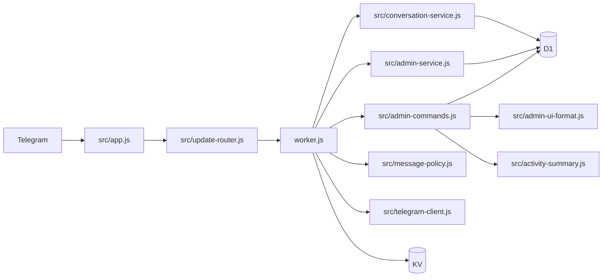

# Telegram Private Chat Gateway - 维护者文档

> Cloudflare Workers 上的 Telegram 私聊安全接入与双向会话网关，当前版本 `1.0.0`。

## 项目定位

项目将 Telegram Bot 私聊转换为管理员超级群组中的独立 Forum Topic，并在消息进入会话前执行 Webhook 校验、幂等声明、人机验证和内容策略。管理员在 Topic 中统一回复用户，并通过角色权限管理用户状态和规则。

## 技术栈

| 层级 | 技术 |
|------|------|
| 运行时 | Cloudflare Workers ES Modules |
| 长期状态 | Cloudflare D1 |
| 短期状态 | Cloudflare KV |
| 消息平台 | Telegram Bot API 和 Forum Topics |
| 人机验证 | Cloudflare Turnstile / 本地题库 |
| 测试 | Vitest、Mock KV、Mock D1、Mock Telegram |
| 文档 | Markdown、Mermaid、自动索引脚本 |

## 架构入口



## 模块索引

| 路径 | 职责 |
|------|------|
| `worker.js` | Telegram 业务编排、验证、会话转发、用户状态命令、媒体组；接入管理看板 handlers |
| `src/app.js` | HTTP 安全入口、Webhook 校验、migrations 和 Scheduled 入口 |
| `src/update-router.js` | Telegram Update 幂等声明、完成和重试状态 |
| `src/conversation-service.js` | 用户、Topic、双向消息、资料卡和消息映射 |
| `src/admin-service.js` | 角色权限、资料卡操作（`v1:*`）、规则和审计 |
| `src/admin-commands.js` | 群管理命令与 `adm:*` 回调编排（menu/sysinfo/stats/rank/find/notes） |
| `src/admin-ui-format.js` | 管理键盘与展示纯函数 |
| `src/activity-summary.js` | CST 日切、热力、sparkline、峰值日 |
| `src/verify-copy.js` | 人机验证用户侧文案 |
| `src/user-copy.js` | 用户拦截/限流与管理告警文案 |
| `src/message-policy.js` | 内容分类、规则校验和策略评估 |
| `src/telegram-client.js` | Telegram API 超时、重试和错误分类 |
| `src/logger.js` | 结构化日志和递归脱敏 |
| `src/maintenance-service.js` | D1 保留期清理 |
| `src/storage/` | D1、KV、短期状态和 Schema migrations |
| `tests/unit/` | 纯函数和服务单元测试 |
| `tests/integration/` | HTTP、D1、会话、幂等、管理命令和维护集成测试 |

## 开发命令

```bash
npm install
npm run dev
npm run test:unit
npm run test:integration
npm test
npm run test:coverage
npm run build:single
npm run sync-docs
```

生产发布：粘贴 `dist/worker.single.js` 到 Cloudflare Dashboard，Bindings/变量/Cron 在控制台配置（见 `docs/deployment.md`）。  
提交时 pre-commit 会自动构建 dist（`npm install` 后 hooks 生效）。

项目没有独立 lint 或 TypeScript typecheck。提交前还应对全部 JavaScript 文件运行 `node --check`，并运行 `git diff --check`。

## 配置边界

- Secrets：`BOT_TOKEN`、`WEBHOOK_SECRET`、可选 `TURNSTILE_SECRET_KEY`
- 必需变量：`SUPERGROUP_ID`
- 推荐变量：`OWNER_IDS`
- 必需 Bindings：`TOPIC_MAP`、`TG_BOT_DB`
- 可选变量：`TURNSTILE_SITE_KEY`、`VERIFICATION_PAGE_URL`、`ADMIN_IDS`、`SPAM_KEYWORDS`、`API_BASE`

完整说明见 `docs/configuration.md`。

## 编码约束

- 保持 `src/app.js` 与 Telegram 业务逻辑解耦。
- 会话和管理员服务通过注入的 storage、telegram 和 logger 接口访问外部状态。
- 群管理 UI（`adm:*`）走 `admin-commands` + `admin-ui-format`；资料卡 `v1:*` 走 `admin-service`，勿混权限模型。
- 用户可见文案：验证用 `verify-copy.js`，其余拦截/限流用 `user-copy.js`。
- 日统计 KV `stats:YYYY-MM-DD` 使用 **CST（UTC+8）** 日历日。
- 用户状态使用 D1 原子部分更新，避免读取整行后覆盖并发状态。
- D1 数据值使用 `.bind()`；动态列名必须来自内部白名单。
- Callback、规则类型、动作和 API Base URL 使用白名单。
- 日志不得包含完整 Telegram Update、消息正文或真实凭据。
- 不要将 `docs/superpowers/` 提交进 Git。
- 新行为和 Bug 修复先写失败测试，再实现最小修复。
- 功能、配置、部署或安全行为变化时同步 README、专题文档和 Changelog。

## 文档导航

- `README.md` / `README_EN.md`：产品首页
- `docs/deployment.md`：从零部署
- `docs/configuration.md`：配置参考
- `docs/architecture.md`：模块与数据流
- `docs/operations.md`：运维和发布检查
- `docs/development.md`：开发和验证流程
- `docs/security.md`：安全边界
- `CHANGELOG.md`：版本历史

## 自动生成索引

以下区块由 `scripts/sync-claude-md.js` 维护。修改 `worker.js`、`src/utils.js` 或 CONFIG 后运行：

```bash
npm run sync-docs
```

<!-- AUTO-GENERATED START: functions -->

## 关键函数索引（自动生成）

> 由 `scripts/sync-claude-md.js` 自动生成，最后同步：2026-07-11。

### worker.js 主函数

| 函数 | 行号 | 职责 |
|------|------|------|
| `containsLink` | L54 | 检测消息文本中是否包含 URL/链接 |
| `buildSpamCheckText` | L68 | 构建反垃圾检测文本：消息正文 + 发送者资料 |
| `detectSpamKeywords` | L85 | 检测消息是否包含垃圾关键词 |
| `computeMessageHash` | L97 | 计算消息内容的简单哈希（用于重复检测） |
| `normalizeTgDescription` | L107 | 标准化 Telegram API 描述字符串 |
| `isTopicMissingOrDeleted` | L114 | 判断话题是否不存在或已被删除 |
| `isTestMessageInvalid` | L128 | 判断探测消息是否因内容为空而失败 |
| `withMessageThreadId` | L137 | 为请求 body 添加 message_thread_id 字段 |
| `parseSpamKeywords` | L145 | 将 SPAM_KEYWORDS 环境变量解析为关键词数组 |
| `generateVerifyCode` | L156 | 生成安全的验证 code（16 字节十六进制） |
| `setBoundedCache` | L215 | — |
| `getBlockedWords` | L258 | 获取完整屏蔽词列表 = 硬编码 + KV 动态词库（合并去重） |
| `recordSystemError` | L295 | — |
| `ephemeralStore` | L334 | — |
| `getVerificationState` | L338 | — |
| `getStoredRules` | L354 | — |
| `evaluateLegacyPolicy` | L364 | — |
| `createLegacyConversationService` | L390 | — |
| `parseIdAllowlist` | L401 | — |
| `idAllowlistHas` | L408 | — |
| `createLegacyAdminService` | L412 | — |
| `setPersistentTrust` | L422 | — |
| `saveLegacyMessageLink` | L432 | — |
| `secureRandomInt` | L451 | 加密安全的随机数生成 |
| `secureRandomId` | L458 | — |
| `safeGetJSON` | L466 | 安全的 JSON 获取 |
| `isSparseTelegramFrom` | L486 | 判断 Telegram from 是否缺少可用于话题标题的资料字段。 |
| `saveUserProfileSnapshot` | L496 | 缓存用户资料，供 Turnstile 验证回放等缺少 from 的路径建话题时使用。 |
| `resolveUserFromForTopic` | L514 | 修复 Turnstile 验证通过后 fakeMsg 仅含 id 导致标题变成「User」的问题。 |
| `getOrCreateUserTopicRec` | L578 | — |
| `probeForumThread` | L665 | — |
| `resetUserVerificationAndRequireReverify` | L721 | — |
| `parseAdminIdAllowlist` | L747 | — |
| `isAdminUser` | L752 | — |
| `getAllKeys` | L791 | 获取所有 KV keys（处理分页） |
| `shuffleArray` | L805 | Fisher-Yates 洗牌算法 |
| `checkRateLimit` | L815 | 速率限制检查 |
| `verifyTurnstileToken` | L828 | 调用 Cloudflare Turnstile API 验证 token |
| `getSpamKeywords` | L857 | 加载/解析垃圾关键词列表 |
| `detectRepeatMessage` | L875 | 检测用户是否在短时间内重复发送相同内容 |
| `pruneMessageHashCache` | L901 | 定期清理过期的 messageHashCache 条目（防止内存无限增长） |
| `spamCheck` | L917 | 综合垃圾检测（关键词 + 链接 + 重复） |
| `notifyAdmin` | L969 | 用于关键异常（转发失败、KV 异常等）向管理员发送即时通知 |
| `updateSpamStats` | L991 | 异步更新 spam 统计计数（在 waitUntil 中调用，不阻塞主响应） |
| `handleSpamMessage` | L1014 | 处理垃圾消息（通知管理员或静默丢弃） |
| `showStatus` | L1092 | — |
| `onTurnstileSuccess` | L1097 | — |
| `onTurnstileError` | L1142 | — |
| `handlePrivateMessage` | L1496 | ---------------- 核心业务逻辑 ---------------- |
| `forwardToTopic` | L1616 | 职责：前置检查 → 获取/创建话题 → 健康检查 → 执行转发 |
| `checkThreadHealth` | L1712 | 话题健康检查 — 双层缓存（内存 + KV）+ 探测 |
| `executeMessageForward` | L1771 | 执行消息转发 — forwardMessage → copyMessage 降级 + 重定向检测 |
| `handleForwardRedirect` | L1815 | 处理转发重定向 — 删除误投消息 + 触发重建 |
| `handleForwardFailure` | L1843 | 处理转发失败 — 话题丢失检测 + copyMessage 降级 + 通知管理员 |
| `removeCommandBotSuffix` | L1896 | 例如：/listwords@callcosr_bot -> /listwords |
| `handleAdminReply` | L1902 | — |
| `isOwnerUser` | L1915 | --- 管理员命令处理函数 --- |
| `getAdminHandlers` | L1922 | — |
| `bumpDailyStat` | L1953 | — |
| `handleHelpCommand` | L1956 | — |
| `handleMenuCommand` | L1959 | — |
| `handleSysinfoCommand` | L1962 | — |
| `handleStatsCommand` | L1965 | — |
| `handleRankCommand` | L1968 | — |
| `handleNotesCommand` | L1971 | — |
| `handleWhoamiCommand` | L1974 | — |
| `handleFindCommand` | L1977 | — |
| `handleSyncCommandsCommand` | L1980 | — |
| `handleAdminUiCallback` | L1983 | — |
| `resolveThreadIdForUser` | L1988 | — |
| `handlePanelCommand` | L2000 | — |
| `handleMuteCommand` | L2041 | — |
| `handleUnmuteCommand` | L2058 | — |
| `handleNoteCommand` | L2076 | — |
| `handleAddWordCommand` | L2108 | — |
| `handleDelWordCommand` | L2150 | — |
| `handleListWordsCommand` | L2204 | — |
| `handleCloseCommand` | L2246 | — |
| `handleOpenCommand` | L2275 | — |
| `handleResetCommand` | L2304 | — |
| `handleTrustCommand` | L2314 | — |
| `handleBanCommand` | L2325 | — |
| `handleUnbanCommand` | L2362 | — |
| `handleInfoCommand` | L2390 | — |
| `_handleAdminReplyInner` | L2479 | 职责：权限检查 → 全局命令路由 → 用户反查 → 话题内指令路由 → 消息转发 |
| `sendVerificationChallenge` | L2680 | ---------------- 验证模块 (纯本地) ---------------- |
| `_sendVerificationChallengeInner` | L2696 | — |
| `sendTurnstileChallenge` | L2754 | Turnstile 验证路径 — 发送验证按钮链接 |
| `sendLocalQuizChallenge` | L2814 | 本地题库验证路径 — 发送选择题 |
| `handleCallbackQuery` | L2868 | — |
| `forwardPendingMessages` | L3013 | 验证通过后转发待处理消息 — 并行转发 + 去重 + 通知用户 |
| `handleCleanupCommand` | L3096 | - 需要批量重置这些用户的状态 |
| `createTopic` | L3256 | 为话题建立 thread->user 映射，避免管理员命令时全量 KV 反查 |
| `updateThreadStatus` | L3270 | 更新话题状态 |
| `buildTopicTitle` | L3309 | 资料缺失时勿在调用方传入仅 { id } 的 from（会退化为 "User"）；应先 resolveUserFromForTopic。 |
| `tgCall` | L3339 | 改进的 Telegram API 调用（添加超时和 HTTPS 强制） |
| `handleMediaGroup` | L3366 | — |
| `extractMedia` | L3387 | 改进的媒体提取（支持更多类型，不修改原数组） |
| `flushExpiredMediaGroups` | L3439 | 实现媒体组清理 |
| `delaySend` | L3462 | 改进媒体组延迟发送 |

### src/utils.js 纯函数

| 函数 | 行号 | 职责 |
|------|------|------|
| `containsBlockedWord` | L12 | 检查文本是否包含屏蔽词 |
| `extractMessageText` | L26 | 提取消息正文与媒体说明，供新消息和编辑消息共享策略。 |
| `containsLink` | L39 | 检测消息文本中是否包含 URL/链接 |
| `buildSpamCheckText` | L55 | 构建反垃圾检测文本：消息正文 + 发送者资料 |
| `detectSpamKeywords` | L75 | 检测消息是否包含垃圾关键词 |
| `computeMessageHash` | L93 | 计算消息内容的简单哈希（用于重复检测） |
| `normalizeTgDescription` | L107 | 标准化 Telegram API 描述字符串 |
| `isTopicMissingOrDeleted` | L116 | 判断话题是否不存在或已被删除 |
| `isTestMessageInvalid` | L132 | 判断探测消息是否因内容为空而失败 |
| `withMessageThreadId` | L144 | 为请求 body 添加 message_thread_id 字段 |
| `parseSpamKeywords` | L154 | 将 SPAM_KEYWORDS 环境变量解析为关键词数组 |
| `generateVerifyCode` | L166 | 生成安全的验证 code（16 字节十六进制） |

<!-- AUTO-GENERATED END: functions -->

<!-- AUTO-GENERATED START: config -->


## CONFIG 配置项（自动生成）

> 由 `scripts/sync-claude-md.js` 自动生成，对应 worker.js 中的 CONFIG 对象。

| 配置项 |
|--------|
| `VERIFY_ID_LENGTH` |
| `VERIFY_EXPIRE_SECONDS` |
| `VERIFIED_EXPIRE_SECONDS` |
| `MEDIA_GROUP_EXPIRE_SECONDS` |
| `MEDIA_GROUP_DELAY_MS` |
| `PENDING_MAX_MESSAGES` |
| `ADMIN_CACHE_TTL_SECONDS` |
| `NEEDS_REVERIFY_TTL_SECONDS` |
| `RATE_LIMIT_MESSAGE` |
| `RATE_LIMIT_VERIFY` |
| `RATE_LIMIT_WINDOW` |
| `BUTTON_COLUMNS` |
| `MAX_TITLE_LENGTH` |
| `MAX_NAME_LENGTH` |
| `API_TIMEOUT_MS` |
| `CLEANUP_BATCH_SIZE` |
| `MAX_CLEANUP_DISPLAY` |
| `CLEANUP_LOCK_TTL_SECONDS` |
| `MAX_RETRY_ATTEMPTS` |
| `THREAD_HEALTH_TTL_MS` |
| `TURNSTILE_VERIFY_TTL` |
| `NEW_USER_LINK_BLOCK_SECONDS` |
| `SPAM_MESSAGE_HASH_TTL` |
| `SPAM_REPEAT_MESSAGE_LIMIT` |
| `SPAM_NOTIFY_ADMIN` |
| `SPAM_SILENCE_MODE` |

<!-- AUTO-GENERATED END: config -->

<!-- AUTO-GENERATED START: kv-keys -->


## KV 键名约定（自动生成）

> 由 `scripts/sync-claude-md.js` 自动扫描 `env.TOPIC_MAP` 调用提取。

| 键名模式 |
|----------|
| `ban_notice:{id}` |
| `banned:{id}` |
| `blocked_words_kv` |
| `chal:{id}` |
| `mute_notice:{id}` |
| `muted:{id}` |
| `needs_verify:{id}` |
| `note:{id}` |
| `profile:{id}` |
| `retry:{id}` |
| `sys:recent_errors` |
| `thread:{id}` |
| `turnstile_code:{id}` |
| `turnstile_msg:{id}` |
| `user_challenge:{id}` |

<!-- AUTO-GENERATED END: kv-keys -->
