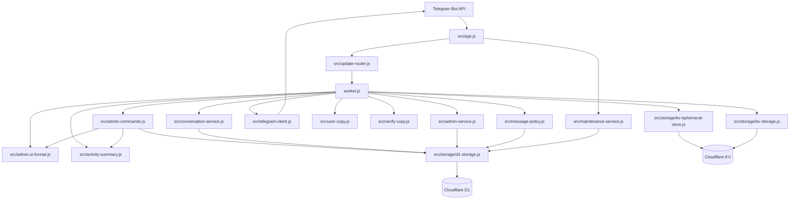
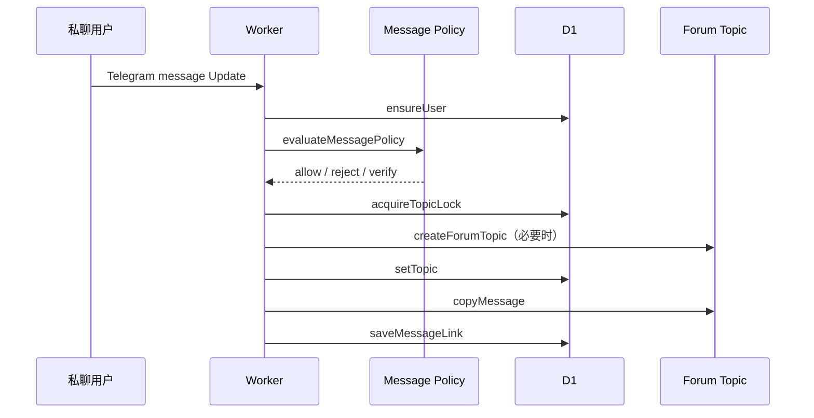

# 系统架构

Telegram Private Chat Gateway 运行在 Cloudflare Workers ES Modules 环境中。系统将 HTTP 安全入口、Telegram Update 幂等、会话编排、管理员授权、内容策略、Telegram API、长期存储和短期状态拆分为明确模块。

## 架构图



## 模块职责

| 模块 | 职责 |
|------|------|
| `worker.js` | Telegram 业务编排、验证与会话转发、用户状态命令、媒体组；通过 `createAdminCommandHandlers` 接入管理看板 |
| `src/app.js` | 健康检查、HTTP 请求限制、Webhook Secret 校验、D1 migrations、Scheduled 入口 |
| `src/update-router.js` | Telegram Update ID 提取、幂等声明、完成和可重试失败状态 |
| `src/conversation-service.js` | `createConversationService()`：用户初始化、Topic 创建锁、双向消息、消息映射和资料卡同步 |
| `src/admin-service.js` | `createAdminService()`：角色授权、私聊管理员入口、资料卡 Callback（`v1:*`）、规则写入和审计 |
| `src/admin-commands.js` | `createAdminCommandHandlers()`：群内 `/menu` `/sysinfo` `/stats` `/rank` `/find` `/notes` 与 `adm:*` 回调编排 |
| `src/admin-ui-format.js` | 管理键盘、排行/热力/空状态等展示纯函数（无 IO） |
| `src/activity-summary.js` | CST 日切、小时热力、7 日 sparkline、峰值日等统计纯函数 |
| `src/verify-copy.js` | 人机验证用户侧文案常量（Turnstile / 题库 / 过期 / 答错 / 成功） |
| `src/user-copy.js` | 用户拦截/限流/封禁静音与管理侧 spam/转发失败等文案常量 |
| `src/message-policy.js` | `evaluateMessagePolicy()`：内容类型识别、规则输入校验、规则匹配和策略结果生成 |
| `src/telegram-client.js` | Telegram API Base 白名单、超时、重试、错误分类和退避 |
| `src/logger.js` | 结构化 JSON 日志和递归脱敏 |
| `src/maintenance-service.js` | `runRetentionCleanup()`：D1 保留期清理 |
| `src/storage/d1-storage.js` | `createD1Storage()`：用户、Topic、消息映射、规则、管理员、审计和幂等记录 |
| `src/storage/kv-ephemeral-store.js` | `createEphemeralStore()`：验证、管理员输入状态、Topic 健康和管理员缓存等短期状态 |
| `src/storage/kv-storage.js` | KV 用户记录兼容读取和短期辅助写入 |
| `src/storage/migrations.js` | D1 Schema 和索引的幂等创建 |

### 管理 UI 双轨

- **群管理快捷 UI（`adm:*`）**：`admin-commands.js` + `admin-ui-format.js`，面向超级群内 `/menu`、`/panel` 按钮与分页看板；权限为群主/管理员、`ADMIN_IDS` 或 `OWNER_IDS`。
- **资料卡服务（`v1:*`）**：`admin-service.js`，角色 Owner / Operator / Rules Manager 与 D1 审计。

## HTTP 入口

`createApp()` 提供两个入口：

- `fetch(request, env, ctx)`：处理健康检查、Telegram Webhook 和其他业务端点。
- `scheduled(event, env)`：执行 D1 保留期清理。

### 健康检查

`GET /` 和 `GET /health` 直接返回 `OK`，不要求 Telegram、KV 或 D1 绑定，可用于 Cloudflare 存活探测。

### Telegram Webhook

`POST /` 按顺序执行：

1. 校验 `WEBHOOK_SECRET` 配置。
2. 要求 `application/json`。
3. 固定时间比较 `X-Telegram-Bot-Api-Secret-Token`。
4. 流式读取并限制请求体为 1 MiB。
5. 校验基础环境和 D1 Binding。
6. 幂等执行 D1 Schema migrations。
7. 解析 Telegram Update。
8. 交给 `routeUpdate()` 声明 Update ID。
9. 只有成功声明的 Update 才进入 `worker.js` 业务处理器。

## Update 幂等状态

`src/update-router.js` 将 Update 归类为：

- `processing`：当前请求正在处理。
- `completed`：处理成功，重复请求直接跳过。
- `retryable`：上次处理失败且允许再次声明。

D1 通过 `INSERT OR IGNORE` 和带状态条件的 `UPDATE` 保证并发请求不会同时处理同一个 Update。处理超时的 `processing` 记录可以在超时窗口后重新声明。

## 私聊消息流



### 用户初始化

`ensureUser()` 使用 `INSERT OR IGNORE` 创建新用户，避免并发请求覆盖已经存在的 Topic、封禁或信任状态。

### Topic 创建

Topic 创建同时使用：

- Worker isolate 内的 Promise 合并，避免同一实例重复创建。
- D1 Topic Lock，避免不同实例或 PoP 同时创建。

锁拥有者创建 Forum Topic 后，只有仍持有相同 token 的请求可以保存 Topic ID。

### 消息映射

用户到管理员和管理员到用户的消息均保存方向、源消息、目标消息、Topic、用户和内容快照哈希。该映射支持编辑消息同步和问题排查，并受 30 天保留期控制。

## 管理员回复流

群组消息首先验证发送者是否为管理员。用户 Topic 优先通过 `thread:<topicId>` KV 映射反查用户，必要时执行有限数量的兼容扫描。

管理员可以：

- 在用户 Topic 中直接回复。
- 使用 `/close`、`/open`、`/reset`、`/trust`、`/ban`、`/unban` 和 `/info`。
- 使用全局屏蔽词和维护命令。

业务错误由顶层管理员回复处理器捕获并写入结构化日志，避免单个 Update 使 Worker 请求异常退出。

## 管理员角色与资料卡

`createAdminService()` 支持：

| 角色 | 主要权限 |
|------|----------|
| Owner | 全部权限；`OWNER_IDS` 中的恢复 Owner 不依赖 D1 记录 |
| Operator | 查看和操作用户状态、回复用户 |
| Rules Manager | 查看、创建、更新和删除规则 |

资料卡 Callback 使用版本化格式：

```text
v1:user:<action>:<userId>
```

支持 `trust`、`ban`、`close`、`mute`。每次 Callback 都重新读取管理员权限，成功操作使用原子字段更新并写入 `admin_audit_log`。

私聊 `/start` 是管理员连接检查入口，不是完整 Web 管理后台。当前 UI 只提供后台连接状态按钮；规则管理能力由服务接口和 D1 存储提供。

## 内容策略

`evaluateMessagePolicy()` 按以下顺序处理：

1. 用户封禁或关闭状态。
2. 启用的 `blocked_keyword` 规则。
3. 未信任用户的验证要求。
4. 启用的 `auto_reply` 规则。
5. 默认允许并转发。

规则按 priority 排序。规则输入限制 pattern、response text、match type、rule type 和 action，并拒绝已知高风险的嵌套量词或重叠正则分支。

Worker 还组合内置和 KV 动态屏蔽词、链接控制及重复消息检测。D1 启用规则使用短 TTL 实例缓存；规则写操作会主动失效缓存。

## D1 与 KV 边界

### D1 长期状态

- 用户资料和会话状态
- Topic ID 和创建锁
- Telegram Update 幂等状态
- 双向消息映射
- 动态内容规则
- 管理员角色
- 管理员审计

### KV 短期状态

- 验证状态和验证挑战
- 待转发消息 ID
- 速率限制
- 管理员检查缓存
- Topic 健康缓存
- 媒体组临时数据
- 动态屏蔽词

实例内 Map 缓存均使用 TTL、容量上限、请求结束清理或 WeakMap 生命周期，避免长寿命 isolate 无界增长。

## 用户资料同步

用户资料快照包含 username、first name 和 last name。资料没有变化且资料卡已存在时不调用 Telegram 或写 D1。资料变化时：

- 按最小间隔更新 Forum Topic 名称。
- 创建或编辑用户资料卡。
- 使用 D1 原子部分更新保存资料字段，避免覆盖并发状态操作。

## Scheduled 保留期清理

`runRetentionCleanup()` 默认删除：

- 7 天前的 Telegram Update 幂等记录
- 30 天前的消息映射
- 90 天前的管理员审计

不会删除用户、Topic、规则、管理员或其他主数据。
